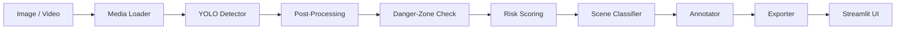

# Architecture

> **⚠️ Prototype Notice:** This document describes a CV research prototype, not a
> production ADAS system.

---

## 1. High-Level Pipeline

```
Input image / video
       │
       ▼
 ┌────────────┐
 │ Media Loader│  ← src/io/media_loader.py
 └─────┬──────┘
       │  frames (numpy arrays)
       ▼
 ┌────────────┐
 │ YOLO       │  ← src/detection/detector.py
 │ Detector   │    (Ultralytics YOLOv8, COCO-pretrained)
 └─────┬──────┘
       │  raw detections
       ▼
 ┌─────────────────┐
 │ Detection Post- │  ← src/detection/schemas.py
 │ Processing      │    Filters by class & confidence,
 └─────┬───────────┘    builds Detection dataclass list
       │
       ▼
 ┌────────────────┐
 │ Danger-Zone    │  ← src/risk/danger_zone.py
 │ Estimation     │    Defines road-region polygon(s)
 └─────┬──────────┘
       │
       ▼
 ┌────────────────┐
 │ Object-Level   │  ← src/risk/scoring.py
 │ Risk Scoring   │    Per-detection risk score (0–100)
 └─────┬──────────┘
       │
       ▼
 ┌────────────────┐
 │ Scene-Level    │  ← src/risk/scene_classifier.py
 │ Classification │    LOW / MEDIUM / HIGH
 └─────┬──────────┘
       │
       ▼
 ┌────────────────┐
 │ Visualization  │  ← src/visualization/annotator.py
 │ & Annotation   │    Overlays boxes, labels, zones
 └─────┬──────────┘
       │
       ▼
 ┌────────────────┐
 │ Export         │  ← src/io/exporters.py
 │ JSON/CSV/Image │    Saves results & annotated frames
 └─────┬──────────┘
       │
       ▼
 ┌────────────────┐
 │ Streamlit UI   │  ← app/streamlit_app.py
 │                │    Upload, view, download
 └────────────────┘
```

---

## 2. Module Descriptions

### 2.1 Media Loader — `src/io/media_loader.py`

Loads image files (`.jpg`, `.jpeg`, `.png`) or video files (`.mp4`, `.avi`).
For videos, extracts frames at a configurable interval (e.g., every *N*-th frame or at a target FPS).
Returns a sequence of NumPy `ndarray` frames in BGR format (OpenCV convention).

### 2.2 YOLO Detector — `src/detection/detector.py`

Wraps `ultralytics.YOLO` to run inference on each frame.
Uses the COCO-pretrained `yolov8n.pt` (nano) model by default for fast CPU inference.
The model variant can be changed via `src/config.py`.

### 2.3 Detection Schemas — `src/detection/schemas.py`

Defines the `Detection` dataclass that carries per-object information through the pipeline:

| Field             | Type              | Description                                      |
|-------------------|-------------------|--------------------------------------------------|
| `class_name`      | `str`             | COCO class label (e.g., `"person"`, `"car"`)     |
| `confidence`      | `float`           | Detector confidence score, 0.0–1.0               |
| `bbox_xyxy`       | `tuple[int, …]`   | Bounding box `(x1, y1, x2, y2)` in pixel coords |
| `bbox_area_ratio` | `float`           | Box area / frame area — proxy for object size    |
| `bottom_center`   | `tuple[int, int]` | `(cx, y2)` — used for zone and position checks   |
| `in_danger_zone`  | `bool`            | Whether `bottom_center` falls inside the danger-zone polygon |
| `risk_score`      | `float`           | Composite risk score, 0–100                      |
| `risk_reason`     | `str`             | Human-readable explanation of the score           |

### 2.4 Danger-Zone Estimation — `src/risk/danger_zone.py`

Defines a trapezoidal polygon representing the road area directly ahead of the camera.
The default polygon is a configurable fraction of the lower-center frame region.
Uses OpenCV `cv2.pointPolygonTest` to check whether a detection's `bottom_center` lies inside the zone.

> **Limitation:** This is a static heuristic, not perspective-aware lane detection.
> It assumes a forward-facing dashcam with the road in the lower-center portion of the frame.

### 2.5 Object-Level Risk Scoring — `src/risk/scoring.py`

Computes a 0–100 risk score per detection using a weighted sum of heuristic features.
See [Risk Model Specification](risk_model.md) for the full formula and weights.

### 2.6 Scene-Level Classification — `src/risk/scene_classifier.py`

Aggregates object-level scores and detection metadata into one of three scene-level risk classes:

| Class      | Score Range | Meaning                                           |
|------------|-------------|---------------------------------------------------|
| **LOW**    | < 35        | No close vulnerable user, low density, no object in danger zone |
| **MEDIUM** | 35–69       | Vehicles or VRUs present but not close to lane center |
| **HIGH**   | ≥ 70        | Pedestrian/cyclist/motorcyclist near danger zone or many close objects |

### 2.7 Visualization — `src/visualization/annotator.py`

Draws on each frame:

- Bounding boxes color-coded by risk level (green / yellow / red)
- Class label + confidence + risk score
- Danger-zone polygon overlay (semi-transparent)
- Scene-level risk badge in the corner

### 2.8 Export — `src/io/exporters.py`

Saves pipeline results to `data/outputs/`:

| Format | Content |
|--------|---------|
| Annotated image(s) | `.jpg` / `.png` with overlays |
| Annotated video | `.mp4` (if input was video) |
| JSON report | Full detection list + scene classification |
| CSV report | One row per detection with all schema fields |

### 2.9 Streamlit UI — `app/streamlit_app.py`

Single-page application providing:

- File upload (image or short video)
- Side-by-side original vs. annotated view
- Expandable detection table
- Risk summary and scene classification
- Download buttons for annotated outputs and reports

---

## 3. Configuration — `src/config.py`

All tunable parameters are centralized here and can be overridden via environment variables or `.env`:

| Parameter | Default | Description |
|-----------|---------|-------------|
| `YOLO_MODEL` | `"yolov8n.pt"` | Model variant |
| `CONFIDENCE_THRESHOLD` | `0.25` | Minimum detector confidence |
| `TARGET_CLASSES` | `["person", "bicycle", "car", "motorcycle", "bus", "truck"]` | Classes to keep |
| `DANGER_ZONE_*` | *(see config)* | Polygon shape parameters |
| `RISK_THRESHOLD_LOW` | `35` | Below this → LOW scene |
| `RISK_THRESHOLD_HIGH` | `70` | At or above this → HIGH scene |

---

## 4. Data Flow Diagram



---

## 5. Technology Choices

| Concern | Choice | Rationale |
|---------|--------|-----------|
| Object detection | YOLOv8 (Ultralytics) | State-of-the-art single-stage detector with easy Python API |
| Image processing | OpenCV + Pillow | Industry standard, broad codec support |
| UI | Streamlit | Rapid prototyping, built-in file upload and media display |
| Data handling | NumPy + Pandas | Efficient array and tabular operations |
| Testing | pytest | Lightweight, widely adopted |

---

## 6. Limitations

- **No real depth estimation.** All "proximity" signals are 2D heuristics derived from bounding-box size and position. Monocular 2D images cannot provide reliable metric distance without camera calibration or a depth-estimation model.
- **Static danger zone.** The danger-zone polygon does not adapt to curves, lane changes, or varying camera angles.
- **No temporal tracking.** Each frame is processed independently — no object tracking, trajectory prediction, or velocity estimation across frames.
- **Single camera assumption.** The pipeline assumes a single forward-facing dashcam viewpoint.

---

*Last updated: 2026-05-14*
