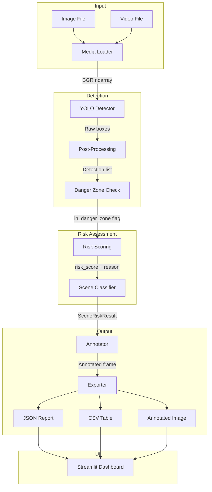

# Technical Report

> **Road Scene Risk Analyzer — Design Decisions & Architectural Rationale**

> **⚠️ Prototype Notice:** This document describes a CV research prototype, not a
> production ADAS system. No real-world safety guarantees are made.

---

## 1. Executive Summary

The Road Scene Risk Analyzer is a computer-vision prototype that processes dashcam images and videos to detect road objects, estimate their proximity to the driving path, and classify the scene's overall risk level. The system uses a YOLOv8 nano model for object detection, a heuristic scoring engine for risk assessment, and a Streamlit web dashboard for interactive analysis.

This report explains the key design decisions, trade-offs, and architectural rationale behind the implementation.

---

## 2. Design Goals

The project was designed with the following priorities:

| Priority | Goal | Rationale |
|----------|------|-----------|
| 1 | **Explainability** | Every risk score must have a traceable, human-readable explanation |
| 2 | **Simplicity** | Avoid over-engineering; keep the pipeline linear and debuggable |
| 3 | **Testability** | All deterministic logic must be unit-testable without GPU or model weights |
| 4 | **Portability** | Must run on CPU without specialized hardware |
| 5 | **Honesty** | Explicitly document all limitations; never overclaim safety capabilities |

---

## 3. Architecture Decisions

### 3.1 Linear Pipeline (No Event-Driven Architecture)

**Decision:** The analysis pipeline follows a simple linear flow: Load → Detect → Score → Classify → Annotate → Export.

**Rationale:**
- A linear pipeline is easier to debug, test, and reason about.
- Each stage has a well-defined input/output contract (NumPy arrays, Detection dataclasses, SceneRiskResult).
- There is no need for async processing or event queues in a single-image/video analysis tool.
- The pipeline is stateless — each invocation is independent, making it trivially parallelizable if needed.

**Trade-off:** No streaming/real-time processing capability. Each frame is fully processed before the next one starts.

### 3.2 Frozen Dataclasses for Detection Schema

**Decision:** The `Detection` dataclass is `frozen=True`, and risk fields are updated via a `with_risk()` copy method.

**Rationale:**
- Frozen dataclasses prevent accidental mutation during the multi-stage pipeline.
- The `with_risk()` method makes the data flow explicit: the original detection from the detector is never modified; a new detection with risk fields is created downstream.
- This makes debugging easier — you can inspect the detection at any stage without worrying about side effects.

**Trade-off:** Slight memory overhead from creating new objects. Negligible for the scale of this application.

### 3.3 Heuristic Scoring (No ML Risk Model)

**Decision:** Risk scores are computed using a weighted sum of hand-crafted features, not a trained model.

**Rationale:**
- **Explainability:** Every score can be decomposed into named components (area, position, zone, VRU, confidence). A neural-network risk model would be a black box.
- **No training data needed:** There are no labeled "risk" datasets for dashcam scenes. Collecting and annotating such data is out of scope.
- **Determinism:** Same input always produces the same output, making the system fully testable.
- **Transparency:** Recruiters and reviewers can understand the scoring logic by reading the code.

**Trade-off:** The heuristic does not learn from data and may produce incorrect rankings in edge cases (e.g., a parked car vs. an approaching car at the same bounding-box position).

### 3.4 Static Danger Zone (No Lane Detection)

**Decision:** The danger zone is a fixed trapezoidal polygon, not a dynamically detected lane.

**Rationale:**
- Lane detection (e.g., via Hough transforms or a lane-detection model) adds significant complexity and failure modes.
- A static polygon is 100% deterministic and testable.
- The polygon is configurable via `src/config.py` or the Streamlit sidebar, allowing manual adjustment.
- For a portfolio prototype, demonstrating the *concept* of danger-zone scoring is more valuable than a fragile lane-detection system.

**Trade-off:** The danger zone does not adapt to curves, intersections, or multi-lane scenarios.

### 3.5 YOLOv8 Nano (Speed Over Accuracy)

**Decision:** Use the `yolov8n.pt` (nano) variant as the default model.

**Rationale:**
- Nano is the fastest YOLOv8 variant and runs comfortably on CPU.
- For road scenes with vehicles and pedestrians, nano provides sufficient accuracy.
- Users can swap to `yolov8s.pt` or `yolov8m.pt` via configuration if they have a GPU.
- The system does not need to detect small or rare objects — the target classes are well-represented in COCO.

**Trade-off:** Lower mAP compared to larger variants. Some distant or occluded objects may be missed.

### 3.6 Streamlit for UI (Rapid Prototyping)

**Decision:** Use Streamlit instead of Flask, FastAPI, or a frontend framework.

**Rationale:**
- Streamlit requires minimal frontend code — the entire UI is defined in a single Python file.
- Built-in file upload, image display, download buttons, and sidebar widgets cover all UI needs.
- No JavaScript, HTML, or CSS needed for the prototype.
- Streamlit's reactive model (re-run on interaction) is well-suited for an analysis dashboard.

**Trade-off:** Limited customization compared to a full frontend. Not suitable for production deployment with many concurrent users.

---

## 4. Risk Model Design

### 4.1 Score Decomposition

The 0–100 risk score is composed of additive components, each representing a different risk signal:

```
score = area_factor     (0–20)
      + y_factor         (0–15)
      + danger_zone      (0 or 30)
      + vulnerable_user  (0 or 25)
      + large_vehicle    (0 or 10)
      + confidence       (0–5)
```

The maximum theoretical score is 105, but the result is clamped to 100.

### 4.2 Why Additive (Not Multiplicative)

An additive model was chosen because:
- Each component contributes independently — a VRU outside the danger zone should still get a VRU bonus.
- Multiplicative models can produce zero scores if any factor is zero (e.g., confidence = 0).
- Additive scores are easier to explain: "30 points because it's in the danger zone."

### 4.3 Threshold Selection

| Threshold | Value | Basis |
|-----------|-------|-------|
| LOW → MEDIUM | 35 | A car in the danger zone (30 pts) + minimal proximity should trigger MEDIUM |
| MEDIUM → HIGH | 70 | A VRU in the danger zone (30 + 25 = 55 pts) + moderate proximity should trigger HIGH |

These thresholds were tuned empirically on sample dashcam images and the demo scenarios described in [docs/demo_scenarios.md](demo_scenarios.md).

---

## 5. Testing Strategy

### 5.1 Test Pyramid

```
          ┌────────────┐
          │ Integration │  ← test_image_pipeline.py, test_video_pipeline.py
          │   Tests     │    (require YOLO model weights)
          ├────────────┤
          │  Unit Tests │  ← test_danger_zone.py, test_scoring.py,
          │             │    test_scene_classifier.py, test_exporters.py
          ├────────────┤
          │ Smoke Tests │  ← test_smoke.py (imports, schema, detector)
          └────────────┘
```

### 5.2 Testing Principles

- **No model dependency for unit tests.** All risk engine tests use synthetic `Detection` objects, not real YOLO output. This makes tests fast, deterministic, and CI-friendly.
- **Acceptance criteria as tests.** Each issue's acceptance criteria are encoded as pytest assertions (e.g., "pedestrian in danger zone must score ≥ 70").
- **Edge cases.** Tests cover boundary conditions: zero frame height, empty detections, polygon edge points, score clamping.

---

## 6. Data Flow



---

## 7. What This Project Demonstrates

This project is designed to showcase the following skills for a portfolio:

| Skill Area | Evidence |
|------------|----------|
| **Computer Vision** | YOLO integration, OpenCV polygon tests, frame annotation |
| **Software Architecture** | Clean module separation, dataclass contracts, pipeline pattern |
| **Python Best Practices** | Type hints, docstrings, frozen dataclasses, configuration management |
| **Testing** | 100+ pytest tests, acceptance-criteria-driven test design |
| **Documentation** | Architecture docs, risk model spec, data strategy, technical report |
| **Web Development** | Streamlit dashboard with file upload, sidebar settings, downloads |
| **Ethical Awareness** | Explicit limitations, prototype disclaimers, no overclaiming |

---

## 8. Known Issues and Future Work

### Current Known Issues

1. The static danger zone polygon does not account for camera pitch/roll variations.
2. Video analysis does not produce an annotated video file — only the riskiest frame is shown.
3. The Streamlit app re-loads the YOLO model on each analysis run if the session is cold.

### Recommended Next Steps

1. **Monocular depth estimation** (MiDaS/ZoeDepth) for distance-aware scoring.
2. **Object tracking** (DeepSORT/ByteTrack) for trajectory prediction and TTC.
3. **Dynamic lane detection** to replace the static danger zone.
4. **Docker deployment** for reproducible, shareable demo environments.
5. **GitHub Actions CI** for automated testing on push.

---

*Last updated: 2026-06-12*
